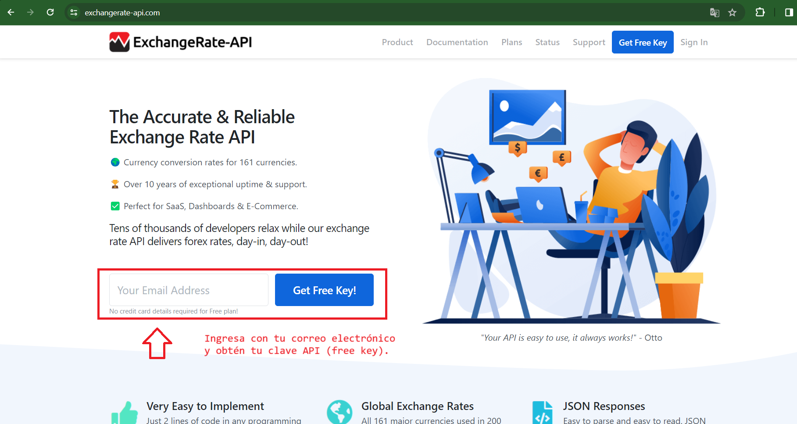
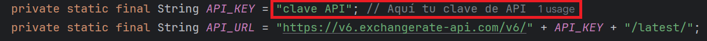

# Challenge Conversor de Monedas

Este es un desafío en el marco del programa ONE dictado por **_Alura Latam_** y **_Oracle Next Education_** que consiste en desarrollar un conversor de monedas en el lenguaje de programación Java.

## Funcionamiento del programa:

1. Comience ingresando la opción de moneda que desea convertir.

   

2. Seguidamente deberá ingresar el monto que desea convertir.

   

3. De esta manera, obtendrá el monto convertido a la moneda requerida.

   

4. Puede elegir otra opción a convertir o utilizar la opción 7 para salir del programa.

Debe tener en cuenta que si ingresa un valor que no corresponda a las opciones existentes, obtendrá un error.

## Ejecución del programa:

Para ejecutar el programa, simplemente sigue estos pasos:
1. Descarga el código fuente desde este repositorio.
2. Abre tu IDE de Java preferido (por ejemplo, Eclipse, IntelliJ IDEA).
3. Importa el proyecto en tu IDE.
4. Ejecuta la clase principal del programa.

## Requisitos previos:
- JDK (Java Development Kit) instalado en tu sistema.
- Conexión a Internet para acceder a la API de tasas de cambio.
- Una cuenta en el sitio web de la API de tasas de cambio para obtener tu clave de API.

#### Obtención de clave API
Para obtener tu clave, es necesario realizar un registro inicial ingresando tu correo electrónico 
(como se muestra en la imagen a continuación). 
Después de esto, recibirás una clave en el correo electrónico proporcionado y estará lista para su uso.

[Exchange Rate API](https://www.exchangerate-api.com/)

Una vez que tengas tu clave la debes ingresar en la clase ConversorMoneda:

De esta manera podras utilizar de forma correcta el programa

- [Visita la página de Alura](https://app.aluracursos.com/dashboard)
- [ONE - Oracle Next Education](https://www.oracle.com/ar/education/oracle-next-education/)

